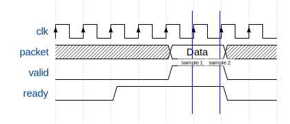

# Universal Memory Interface (UMI)

## Overview

The Universal Memory Interface (UMI) is a latency insensitive
packet based memory interface with transactions divided into
physically separate request and response channels.

## Signal Interface

UMI channel signal bundle consists of a packet, a valid signal,
and a ready signal with the following naming convention:

```
umi<host|dev>_<req|response>_<packet|ready|valid>
```

Connections shall only be made between hosts and devices,
per the diagram below.


Modules can have a UMI host port, device port, or both.

```verilog

// HOST VERILOG
output        uhost_req_valid;
output[255:0] uhost_req_packet;
input         uhost_req_ready;
input         uhost_resp_valid;
input[255:0]  uhost_resp_packet;
output        uhost_resp_ready;

// DEVICE VERILOG
input         udev_req_valid;
input[255:0]  udev_req_packet;
output        udev_req_ready;
output        udev_resp_valid;
output[255:0] udev_resp_packet;
input         udev_resp_ready;
```

## Handshake Protocol


UMI adheres to the following ready/valid handshake protocol:
1. A transaction occurs on every rising clock edge in which READY and VALID are both asserted.
2. Once VALID is asserted, it must not be de-asserted until a transaction completes.
3. READY, on the other hand, may be de-asserted before a transaction completes.
3. The assertion of VALID must not depend on the assertion of READY.  In other words, it is not legal for the VALID assertion to wait for the READY assertion.
4. However, it is legal for the READY assertion to be dependent on the VALID assertion (as long as this dependence is not combinational).

#### Legal: VALID asserted before READY


#### Legal: READY asserted before VALID


#### Legal: READY and VALID asserted simultaneously


#### Legal: READY toggles with no effect


#### **ILLEGAL**: VALID de-asserted without waiting for READY


#### Legal: VALID asserted for multiple cycles

In this case, multiple transactions occur.



#### Example Bidirectional Transaction


## Packet Structure

UMI packets are encoded with the scheme shown below.


| [UW-1:32]  | [31:12]   | [11:8] |  [7:0]       |
|------------|-----------|--------|--------------|
| MESSAGE    | OPTIONS   | SIZE   | COMMAND      |

## Transaction Types

UMI transactions are split into separate request and
response channels.

In case of channel multiplexing, responses take priority over requests.

The table below gives a summary of all UMI transaction
opcodes.

| TRANSACTION    | P7:0 |  DESCRIPTION                               |
|----------------|------|--------------------------------------------|
| INVALID        | 00   | Invalid
| REQ_READ       | 02   | Read request (returns data response)
| REQ_WRITE      | 04   | Write request (with acknowledge)
| REQ_POSTED     | 06   | Write request (**without** acknowledge)
| REQ_MULTICAST  | 08   | Multicast request (**without** acknowledge)
| REQ_YYY        | 0A   | Reserved
| REQ_ZZZ        | 0C   | Reserved
| REQ_ATOMICADD  | 0E   | Atomic add operation
| REQ_ATOMICAND  | 1E   | Atomic and operation
| REQ_ATOMICOR   | 2E   | Atomic or operation
| REQ_ATOMICXOR  | 3E   | Atomic xor operation
| REQ_ATOMICMAX  | 4E   | Atomic max operation
| REQ_ATOMICMIN  | 5E   | Atomic min operation
| REQ_ATOMICMAXU | 6E   | Atomic unsigned max operation
| REQ_ATOMICMINU | 7E   | Atomic unsigned min operation
| REQ_ATOMICSWAP | 8E   | Atomic swap operation
| -------------  | ---- | -----------------------
| RESP_READ      | 01   | Response to read request
| RESP_WRITE     | 03   | Response (ack) to write request
| RESP_ATOMIC    | 05   | Response to atomic request
| RESP_STREAM    | 07   | Streaming unordered write
| RESP_XXX       | 09   | Reserved
| RESP_XXX       | 0B   | Reserved
| RESP_XXX       | 0D   | Reserved
| RESP_XXX       | 0F   | Reserved

## Data Sizes Supported

* The number of bytes in the request/reseponse is 2^SIZE.
* The range of sizes supported is system dependent.
* The minimum data transfer size if >=AW.

| SIZE | TRANSER  | NOTE           |
|------|----------|----------------|
| 0    | 1B       | Single byte    |
| 1    | 2B       |                |
| 2    | 4B       |                |
| 3    | 8B       |                |
| 4    | 16B      | 128b per cycle |
| 5    | 32B      |                |
| 6    | 64B      | Cache line     |
| 7    | 128B     |                |
| 8    | 256B     |                |
| 9    | 512B     |                |
| 10   | 1,024B   |                |
| 11   | 2,048B   |                |
| 12   | 4,096B   |                |
| 13   | 8,192B   |                |
| 14   | 16,384B  | >Jumbo frame   |
| 15   | 32,657B  |                |

## Message Encoding

### Single Cycle Write

|AW |255:224 |223:192  |191:160 |159:128 |127:96 |95:64  | 63:32 | 31:0  |
|---|--------|---------|--------|--------|-------|-------|-------|-------|
|64 |A[63:32]|D[127:96]|D[95:64]|D[63:32]|D[31:0]|       |A[31:0]|C[31:0]|
|32 |        |D[127:96]|D[95:64]|D[63:32]|D[31:0]|       |A[31:0]|C[31:0]|

### Single Cycle Read Request

|AW |255:224 |223:192  |191:160 |159:128 |127:96 |95:64  | 63:32 | 31:0  |
|---|--------|---------|--------|--------|-------|-------|-------|-------|
|64 |A[63:32]|S[63:32] |        |        |       |S[31:0]|A[31:0]|C[31:0]|
|32 |        |         |        |        |       |S[31:0]|A[31:0]|C[31:0]|

### Single Cycle Atomic

|AW |255:224 |223:192  |191:160 |159:128 |127:96 |95:64  | 63:32 | 31:0  |
|---|--------|---------|--------|--------|-------|-------|-------|-------|
|64 |A[63:32]|S[63:32] |D[95:64]|D[63:32]|D[31:0]|S[31:0]|A[31:0]|C[31:0]|
|32 |        |         |        |        |D[31:0]|S[31:0]|A[31:0]|C[31:0]|


### Multi Cycle Write

|255:224   |223:192  |191:160 |159:128 |127:96 |95:64     |63:32     | 31:0    |
|----------|---------|--------|--------|-------|----------|----------|----------|
|A[63:32]  |D[127:96]|D[95:64]|D[63:32]|D[31:0]|          |A[31:0]   |C[31:0]   |
|D[159:128]|D[127:96]|D[95:64]|D[63:32]|D[31:0]|D[255:224]|D[223:192]|D[191:160]|

### 802.3 Ethernet Packet (AW=64)

* 112b ethernet header sent on first cycle
* Transaction size set to total ethernet frame + control + 2 empty bytes on first cycle

|255:224   |223:192     |191:160 |159:128 |127:96  |95:64     | 63:32    | 31:0     |
|----------|------------|--------|--------|--------|----------|----------|----------|
|A[63:32]  |00,H[111:96]|H[95:64]|H[63:32]|H[31:0] |          |A[31:0]   |C[31:0]   |
|D[159:128]|D[127:64]   |D[95:64]|D[63:32]|D[31:0] |D[255:224]|D[223:192]|D[191:160]|
|D[159:128]|D[127:64]   |D[95:64]|D[63:32]|D[31:0] |D[255:224]|D[223:192]|D[191:160]|
|D[159:128]|D[127:64]   |D[95:64]|D[63:32]|D[31:0] |D[255:224]|D[223:192]|D[191:160]|
|D[159:128]|D[127:64]   |D[95:64]|D[63:32]|D[31:0] |D[255:224]|D[223:192]|D[191:160]|
|D[159:128]|D[127:64]   |D[95:64]|D[63:32]|D[31:0] |D[255:224]|D[223:192]|D[191:160]|

### 802.3 Ethernet Packet (AW=64)

* 112b ethernet header sent on first cycle
* Transaction size set to total ethernet frame + control + 2 empty bytes on first cycle

|255:224   |223:192     |191:160 |159:128 |127:96  |95:64     | 63:32    | 31:0     |
|----------|------------|--------|--------|--------|----------|----------|----------|
|A[63:32]  |00,H[111:96]|H[95:64]|H[63:32]|H[31:0] |          |A[31:0]   |C[31:0]   |
|D[159:128]|D[127:64]   |D[95:64]|D[63:32]|D[31:0] |D[255:224]|D[223:192]|D[191:160]|
|D[159:128]|D[127:64]   |D[95:64]|D[63:32]|D[31:0] |D[255:224]|D[223:192]|D[191:160]|
|D[159:128]|D[127:64]   |D[95:64]|D[63:32]|D[31:0] |D[255:224]|D[223:192]|D[191:160]|
|D[159:128]|D[127:64]   |D[95:64]|D[63:32]|D[31:0] |D[255:224]|D[223:192]|D[191:160]|
|D[159:128]|D[127:64]   |D[95:64]|D[63:32]|D[31:0] |D[255:224]|D[223:192]|D[191:160]|

### CXL.IO Latency Optimized 256B Flit (AW=64)

* 16b cxl header set on first cycle
* Transaction size set to 256 bytes (plus 14 empty byts on first cycle)

|255:224   |223:192  |191:160 |159:128 |127:96   |95:64         | 63:32    | 31:0     |
|----------|---------|--------|--------|---------|--------------|----------|----------|
|A[63:32]  |         |        |        |0,H[15:0]|              |A[31:0]   |C[31:0]   |
|D[159:128]|D[127:64]|D[95:64]|D[63:32]|D[31:0]  |D[255:224]    |D[223:192]|D[191:160]|
|D[159:128]|D[127:64]|D[95:64]|D[63:32]|D[31:0]  |0,D[239:224]  |D[223:192]|D[191:160]|
|D[159:128]|D[127:64]|D[95:64]|D[63:32]|D[31:0]  |D[255:224]    |D[223:192]|D[191:160]|
|D[159:128]|D[127:64]|D[95:64]|D[63:32]|D[31:0]  |CRC,D[239:224]|D[223:192]|D[191:160]|
|D[159:128]|D[127:64]|D[95:64]|D[63:32]|D[31:0]  |D[255:224]    |D[223:192]|D[191:160]|
|D[159:128]|D[127:64]|D[95:64]|D[63:32]|D[31:0]  |D[255:224]    |D[223:192]|D[191:160]|
|D[159:128]|D[127:64]|D[95:64]|D[63:32]|D[31:0]  |D[255:224]    |D[223:192]|D[191:160]|
|D[159:128]|D[127:64]|D[95:64]|D[63:32]|D[31:0]  |CRC,M,TLP     |D[223:192]|D[191:160]|
